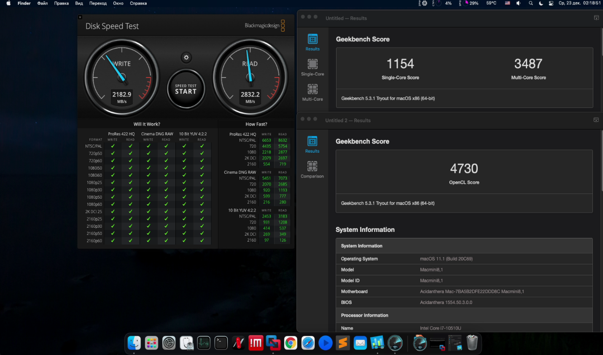
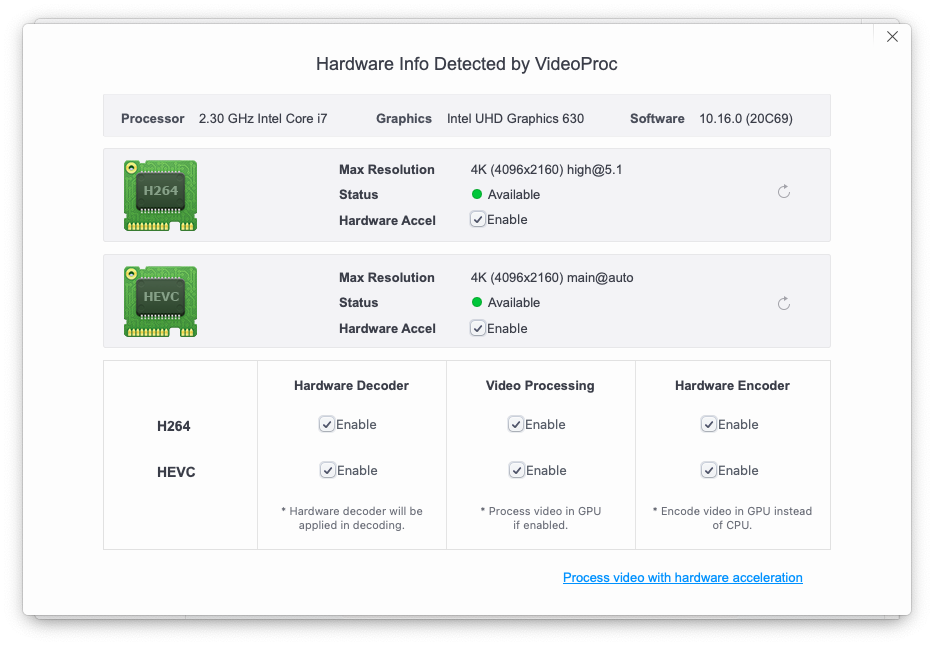

## BIOS Settings:

* Advanced
    -	CPU Configuration
            -	Software Guard Extensions (SGX) → **Disabled**
	        -	Intel (VMX) Virtualization Technology → **Enabled**
	        -	Active Processor Cores → **All**
    -	System Agent (SA) Configuration
	        -	VT-d → **Enabled**
    -	PCH Configuration
	        -	IOAPIC 24-119 Entries → **Enabled**
    -	PCH Storage Configuration
	        -	SATA Mode Selection → **AHCI**
		    -   Aggressive LPM Support → **Enabled**
		    -   SMART Self Test → **On**
		    -   M.2 → **Enabled**
		    -   SATA6G → **Enabled**
		    -   Hot Plug → **Disabled**
    -	PCH-FW Configuration
	        -	Intel Platform Trust Technology → **Disable**
    -	Onboard Devices Configuration
	        -   HD Audio → **Enabled**
		    -   Intel LAN Controller → **Enabled**
		    -   Connectivity mode (WiFi & Bluetooth) → **Enable**
		    -   Display Priority → **HDMI**
		    -   Onboard CIR → **Enabled**
		    -   HDMI CEC Control → **Disabled**
    -	APM Configuration
	        -	ErP Ready → **Disabled**
		    -   CEC Ready → **Disabled**
		    -   Restore AC Power Loss → **Power Off**
		    -   Power On By PCI-E → **Disabled**
		    -   Power By RTC → **Disabled**
		    -   USB S5 Wakeup Support → **Disabled**
    -	USB Configuration
	    	-   Legacy USB Support → **Enabled**
		    -   XHCI Hand-off → **Enabled**
		    -   USB Single Port Control
			    -   U32G1_1 → **Enabled**
			    -   U32G1_2 → **Enabled**
			    -   U32G1_3 → **Enabled**
			    -   U32G2_C1 → **Enabled**
			    -   U32G1_C2 → **Enabled**
    -	Network Stack Configuration
            -   Network Stack → **Disabled**

## Kexts:
| #    | Kext                                                         | Version | Description                                                  |
| ---- | ------------------------------------------------------------ | ------- | :----------------------------------------------------------- |
| 1    | [AirportItlwm](https://github.com/OpenIntelWireless/itlwm/releases) | 1.1.0   | WiFi driver and native WiFi menu                             |
| 2    | [AppleALC](https://github.com/acidanthera/AppleALC/releases) | 1.5.5   | Native macOS HD audio for not officially supported codecs without any filesystem modifications |
| 3    | [CPUFriendDataProvider](https://github.com/acidanthera/CPUFriend/releases) | 1.2.2   | CPU Power Management                                         |
| 4    | [CtlnaAHCIPort](https://github.com/dortania/OpenCore-Install-Guide/blob/master/extra-files/CtlnaAHCIPort.kext.zip) | -       | SATA controllers                                             |
| 5    | [FakePCIID_Intel_HDMI_Audio](https://bitbucket.org/RehabMan/os-x-fake-pci-id/downloads/) | 1027    | FakePCIID plugin, used for HDMI Audio                        |
| 6    | [FakePCIID](https://bitbucket.org/RehabMan/os-x-fake-pci-id/downloads/) | 1027    | Provide alternate PCI ID when another driver attached to the same device requests them |
| 7    | [IntelBluetoothFirmware](https://github.com/OpenIntelWireless/IntelBluetoothFirmware/releases) | 1.1.2   | Native Bluetooth support for Intel                           |
| 8    | [IntelBluetoothInjector](https://github.com/OpenIntelWireless/IntelBluetoothFirmware/releases) | 1.1.2   | `On`/`Off` switch on the Bluetooth panel, component of IntelBluetoothFirmware |
| 9    | [IntelMausi](https://github.com/acidanthera/IntelMausi/releases) | 1.0.4   | Driver for Intel NICs                                        |
| 10   | [Lilu](https://github.com/acidanthera/Lilu/releases)         | 1.5.0   | A kext to patch many processes, required for AppleALC, WhateverGreen, VirtualSMC and many other kexts |
| 11   | [NVMeFix](https://github.com/acidanthera/NVMeFix/releases)   | 1.0.4   | Used for fixing power management and initialization on non-Apple NVMe |
| 12   | [SMCProcessor](https://github.com/acidanthera/VirtualSMC/releases) | 1.1.9   | VirtualSMC plugin, used for monitoring CPU temperature       |
| 13   | [SMCSuperIO](https://github.com/acidanthera/VirtualSMC/releases) | 1.1.9   | VirtualSMC plugin, used for monitoring fan speed             |
| 14   | [USBMap](https://github.com/corpnewt/USBMap)                 | -       | Used for USB 2/3, Type-C, Bluetooth mapping                  |
| 15   | [VirtualSMC](https://github.com/acidanthera/VirtualSMC/releases) | 1.1.9   | Emulates the SMC chip found on real macs, without this macOS will not boot |
| 16   | [WhateverGreen](https://github.com/acidanthera/whatevergreen/releases) | 1.4.5   | Used for graphics patching DRM, boardID, framebuffer fixes, etc, all GPUs benefit from this kext |
--------

## ACPI SSDT:
| SSDT Table     | Description                                                  |
| -------------- | ------------------------------------------------------------ |
| SSDT-AWAC      | Force enable RTC                                             |
| SSDT-EC-USBX   | Fixes both the embedded controller and USB power             |
| SSDT-PLUG-PN62 | Allows for native CPU power management                       |
| SSDT-PMC       | Fixing NVRAM, brings back NVRAM support                      |
| SSDT-RHUB-PN62 | Needed to fix Root-device errors on Asus and potentially MSI boards |
| SSDT-SBUS-MCHC | Fixing SMBus support                                         |
--------

## Post-Install
After successful installation macOS, open your terminal app and paste following commands:

```bash
sudo pmset autopoweroff 0
sudo pmset powernap 0
sudo pmset standby 0
sudo pmset proximitywake 0
```

This will:
* Disables autopoweroff: This is a form of hibernation
* Disables powernap: Used to periodically wake the machine for network, and updates(but not the display)
* Disables standby: Used as a time period between sleep and going into hibernation
* Disables wake from iPhone/Watch: Specifically when your iPhone or Apple Watch come near, the machine will wake

## Benchmarks:

### Disk Speed Test + Geekbench

### VideoProc


## Recomended Tools and Apps:
* [Python](https://www.python.org/downloads/release/python-391/) for running python scripts and tools
* [gibMacOS](https://github.com/corpnewt/gibMacOS) python script that can download macOS components direct from Apple
* [GenSMBIOS](https://github.com/corpnewt/GenSMBIOS) python script that uses acidanthera's macserial to generate SMBIOS and optionally saves them to a plist
* [MountEFI](https://github.com/corpnewt/MountEFI) or [ESP Mounter Pro](https://www.olarila.com/topic/4975-esp-mounter-pro-v19/) for mount EFI volume
* [ProperTree](https://github.com/corpnewt/ProperTree) ProperTree is a cross-platform GUI plist editor written using Python
* [SSDTTime](https://github.com/corpnewt/SSDTTime) a simple tool designed to make creating SSDTs simple
* [MaciASL](https://github.com/acidanthera/MaciASL) for edit your SSDT tables *.dsl, *.aml
* [IORegistryExplorer](https://github.com/khronokernel/IORegistryClone)  a lightweight system utility that allows macOS users to browse their IO registry utilizing streamlined GUI interface
* [Hackintool](https://github.com/headkaze/Hackintool) The Swiss army knife of vanilla Hackintoshing
* [CPUFriend](https://github.com/fewtarius/CPUFriendFriend) python script will inspect the frequency vectors of the X86PlatformPlugin plist matching your SMBIOS configuration and leverage acidanthera's CPUFriend ResourceConverter to help you optimize your power management configuration.
* [USBMap](https://github.com/corpnewt/USBMap)  python script for mapping USB ports in macOS and creating a custom injector kext
* [gfxutil](https://github.com/acidanthera/gfxutil) a tool to work with Device Properties commonly found in Apple Mac firmwares
* [VDADecoderCheck](https://github.com/cylonbrain/VDADecoderCheck) Small command line tool that checks the capabilities of your graphics hardware & OS to decode h264 videos on your GPU


## References:
* [Installation macOS and Opencore bootloader](https://dortania.github.io/OpenCore-Install-Guide/)
* [ACPI SSDT editing](https://dortania.github.io/Getting-Started-With-ACPI/)
* [OpenCore Configuration](https://github.com/acidanthera/OpenCorePkg/blob/master/Docs/Configuration.pdf)
* [Fixing iMessage and other services with OpenCore](https://dortania.github.io/OpenCore-Post-Install/universal/iservices.html)

## Credits:
* https://applelife.ru/
* https://github.com/acidanthera
* https://github.com/OpenIntelWireless
* https://github.com/RehabMan
* https://github.com/Mieze
* https://github.com/corpnewt
* https://github.com/SergeySlice
* https://www.tonymacx86.com/
* https://www.reddit.com/r/hackintosh/
* https://www.insanelymac.com/forum/
* https://www.olarila.com/
