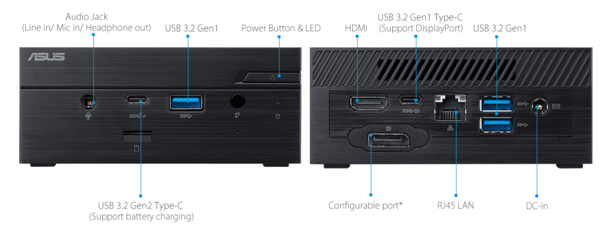
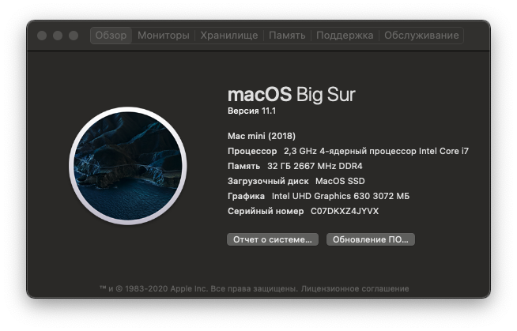

# Hackintosh-ASUS-PN62

This is the hackintosh based on OpenCore bootloader for [ASUS Mini PC PN62](https://www.asus.com/us/Mini-PCs/Mini-PC-PN62/).

Tested with Catalina and Big Sur. If you want Catalina, change basic kext AirportItlwm with [Catalina support](https://heliport.bat-bat.workers.dev/https://github.com/OpenIntelWireless/itlwm/releases/download/v1.1.0/AirportItlwm_v1.0_Beta_Catalina.kext.zip).

Current Bootloader: [OpenCore 0.6.4](https://github.com/acidanthera/OpenCorePkg/releases/tag/0.6.4)

## Hardware:
Note * - Not included in stock mini PC

| Component     | Details                                                      | DeviceID                       | Comment                                                      |
| ------------- | ------------------------------------------------------------ | ------------------------------ | ------------------------------------------------------------ |
| CPU           | [Intel® Core™ i7-10510U](https://ark.intel.com/content/www/us/en/ark/products/196449/intel-core-i7-10510u-processor-8m-cache-up-to-4-90-ghz.html) | -                              | Turbo Frequency working nice, FAN. For monitoring CPU, GPU, Drives, and other devices, you can install [Intel® Power Gadget](https://software.intel.com/content/www/us/en/develop/articles/intel-power-gadget.html#attachment-heading), [iStat Menus](https://bjango.com/mac/istatmenus/)  and [TG Pro](https://www.tunabellysoftware.com/tgpro/) |
| iGPU          | Intel® UHD Graphics                                          | 0x3E9B                         | Used with HDMI output for TV, DisplayPort not tested. 3072MB VRAM - just cosmetics |
| RAM*          | [Kingston 2x16GB 2666MHz DDR4](https://www.memorybenchmark.net/ram.php?ram=Kingston+KHX2666C15S4%2F16G+16GB&id=10472) + [Radiator](https://aliexpress.ru/item/4000815476029.html?spm=a2g0s.9042311.0.0.49aa33edmGILIA&sku_id=10000015569302262) | -                              | Radiators just for fan                                       |
| Ethernet      | [Intel® I219-V](https://ark.intel.com/content/www/us/en/ark/products/82186/intel-ethernet-connection-i219-v.html) | 0x0D4F                         | Working without problem                                      |
| Wireless / BT | [Intel® Wi-Fi 6 AX201 + Bluetooth® 5.1](https://www.intel.com/content/www/us/en/products/docs/wireless/wi-fi-6-ax201-module-brief.html?wapkw=ax201) | 0x02F0+0x0026 (BT)             | WiFi and BT working without problem                          |
| Sound card    | Realtek® ALC3236-VB2/ALC255                                  | 0x9D74                         | HDMI, Audio Jack working without problem. For alternative sound control with HDMI support, i use [SoundSource](https://rogueamoeba.com/soundsource/) application |
| SSD*          | [Samsung SSD 970 PRO 512GB](https://www.samsung.com/us/computing/memory-storage/solid-state-drives/ssd-970-pro-nvme-m2-512gb-mz-v7p512bw/#) + [Radiator](https://aliexpress.ru/item/4000834407360.html?spm=a2g0s.8937460.0.0.14352e0ekHrmCw) | 0xA808                         | Installed macOS system, Radiator just for fan, this SSD cold and not needed this |
| HDD*          | [HGST HTS541010A7E630 1TB](https://www.hdsentinel.com/storageinfo_details.php?lang=en&model=HITACHI%20HTS541010A7E630) | -                              | Used for Time Machine, backups                               |
| Card Reader   | Realtek® RTS5129                                             | 0x0129+0x02ED (USB Controller) | Not working in macOS at this time, but you can use "[hack](https://github.com/ManuGithubSteam/XiaoMi-Pro-2018-HackintoshOC/wiki/2.0-Setup-SD-Card-Reader)" |
| SMBIOS        | [MacMini 8,1](https://support.apple.com/kb/SP782?viewlocale=en_US&locale=en_US) | -                              |                                                              |
--------

## Bios Settings:

## Kexts:
| #    | Kext                                                         | Version | Description                                                  |
| ---- | ------------------------------------------------------------ | ------- | :----------------------------------------------------------- |
| 1    | [AirportItlwm](https://github.com/OpenIntelWireless/itlwm/releases) | 1.1.0   | WiFi and native menu                                         |
| 2    | [AppleALC](https://github.com/acidanthera/AppleALC/releases) | 1.5.5   | Audio, AppleHDA patching                                     |
| 3    | [CPUFriendDataProvider](https://github.com/acidanthera/CPUFriend/releases) | 1.2.2   | CPU Power Management                                         |
| 4    | [CtlnaAHCIPort](https://github.com/dortania/OpenCore-Install-Guide/blob/master/extra-files/CtlnaAHCIPort.kext.zip) | -       | SATA controllers                                             |
| 5    | [FakePCIID_Intel_HDMI_Audio](https://bitbucket.org/RehabMan/os-x-fake-pci-id/downloads/) | 1027    | FakePCIID plugin, used for HDMI Audio                        |
| 6    | [FakePCIID](https://bitbucket.org/RehabMan/os-x-fake-pci-id/downloads/) | 1027    | IOPCIDevice                                                  |
| 7    | [IntelBluetoothFirmware](https://github.com/OpenIntelWireless/IntelBluetoothFirmware/releases) | 1.1.2   | Native Bluetooth support for Intel                           |
| 8    | [IntelBluetoothInjector](https://github.com/OpenIntelWireless/IntelBluetoothFirmware/releases) | 1.1.2   | `On`/`Off` switch on the Bluetooth panel, component of IntelBluetoothFirmware |
| 9    | [IntelMausi](https://github.com/acidanthera/IntelMausi/releases) | 1.0.4   | Driver for Intel NICs                                        |
| 10   | [Lilu](https://github.com/acidanthera/Lilu/releases)         | 1.5.0   | A kext to patch many processes, required for AppleALC, WhateverGreen, VirtualSMC and many other kexts |
| 11   | [NVMeFix](https://github.com/acidanthera/NVMeFix/releases)   | 1.0.4   | Used for fixing power management and initialization on non-Apple NVMe |
| 12   | [SMCProcessor](https://github.com/acidanthera/VirtualSMC/releases) | 1.1.9   | VirtualSMC plugin, used for monitoring CPU temperature       |
| 13   | [SMCSuperIO](https://github.com/acidanthera/VirtualSMC/releases) | 1.1.9   | VirtualSMC plugin, used for monitoring fan speed             |
| 14   | [USBMap](https://github.com/corpnewt/USBMap)                 | -       | Used for USB 2/3, Type-C, Bluetooth                          |
| 15   | [VirtualSMC](https://github.com/acidanthera/VirtualSMC/releases) | 1.1.9   | Emulates the SMC chip found on real macs, without this macOS will not boot |
| 16   | [WhateverGreen](https://github.com/acidanthera/whatevergreen/releases) | 1.4.5   | Used for graphics patching DRM, boardID, framebuffer fixes, etc, all GPUs benefit from this kext |
--------

## ACPI SSDT:
| SSDT Table     | Description                                                  |
| -------------- | ------------------------------------------------------------ |
| SSDT-AWAC      | Force enable RTC                                             |
| SSDT-EC-USBX   | Fixes both the embedded controller and USB power             |
| SSDT-PLUG-PN62 | Allows for native CPU power management                       |
| SSDT-PMC       | Fixing NVRAM, brings back NVRAM support                      |
| SSDT-RHUB-PN62 | Needed to fix Root-device errors on Asus and potentially MSI boards |
| SSDT-SBUS-MCHC | Fixing SMBus support                                         |
--------

## Benchmarks:

### Disk Speed Test + Geekbench

### Videoproc
